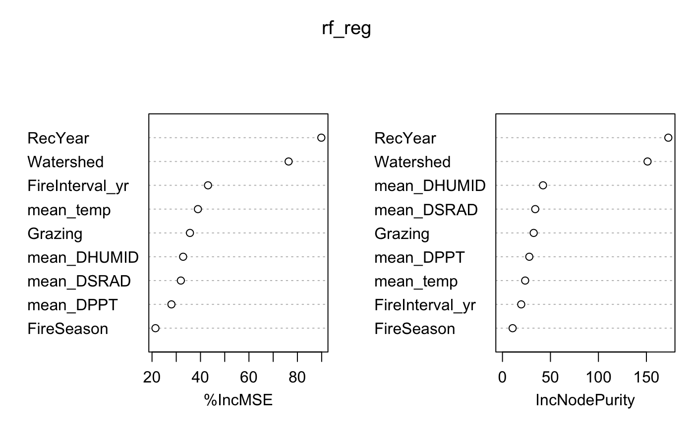

# 🦬 Bison Impact on Tallgrass Prairie Biodiversity

This project investigates the long-term ecological impact of **bison reintroduction** on grassland plant diversity in the **Konza Prairie Biological Station (KPBS)**, Kansas, USA. It replicates and extends the findings of *Ratajczak et al. (2022)* using expanded spatial data and modern data analysis techniques, including machine learning.

## 📌 Background

Tallgrass prairies are among the most threatened ecosystems in North America. The extirpation of native megafauna like bison has altered ecological processes, reducing biodiversity and resilience. This project explores how reintroducing **bison**, compared to **cattle grazing** or no grazing, affects plant diversity, ecosystem stability, and drought resilience over nearly three decades.

## 🧪 Objectives

- Quantify plant diversity using **Richness**, **Shannon**, and **Simpson** indices.
- Integrate vegetation, climate, and fire datasets into a unified analysis.
- Use **Random Forest models** to identify key environmental drivers of diversity.
- Replicate long-term diversity trends from literature across a larger number of watersheds.
- Align results with key findings from *Ratajczak et al. (2022)*

## 🗂️ Data Sources

- **Vegetation Data:**
  - `PVC021.csv` (bison-grazed plots)
  - `PBG011.csv` (cattle-grazed plots)
- **Environmental Data:**
  - `AWE012.csv` (daily weather records)
  - `Watersheds.csv` (fire intervals, seasons, watershed IDs)

## 🧠 Method Overview

### 🔹 Script 1: `New_vegetation.Rmd`
- Loads and merges bison and cattle vegetation data.
- Constructs unique `plot_ID`s from watershed, transect, soil, and date.
- Calculates:
  - **Species richness** (`specnumber()`)
  - **Simpson Index**
  - **Shannon Index**
- Outputs: Species matrix and diversity index table.

### 🔹 Script 2: `New_Environmental.Rmd`
- Processes meteorological data (TAVE, DHUMID, DSRAD, DPPT).
- Aggregates seasonal climate averages (April–October).
- Merges climate, fire, and vegetation data into a single analysis-ready file.

## 📊 Preliminary Results

### Key Insights

- **RecYear** was the most important predictor across all diversity metrics (Richness, Simpson, Shannon), indicating strong temporal trends.
- **Watershed** ranked second, showing clear spatial differences—particularly in bison-grazed areas.
- **FireInterval_yr** and **FireSeason** had moderate influence, supporting the role of fire in shaping plant communities.

### 🔎 Diversity Metric Comparison

- **Species Richness** had the **lowest prediction error**, followed by **Shannon**, then **Simpson**, suggesting Richness is the most robust and stable metric across space and time.
- While **RecYear** and **Watershed** were consistently important across all models, the **importance of predictors varied**:
  - **FireInterval_yr** was more influential for **Simpson**, reflecting its sensitivity to community evenness.
  - **Mean temperature** and **precipitation** had greater influence in the **Shannon model**, pointing to environmental control on species abundance distribution.
  - **Richness** was less sensitive to environmental fluctuations and more driven by broad spatial (Watershed) and temporal (RecYear) patterns.

These differences highlight the complementary ecological insights each metric provides.

## 🖼️ Visual Summary

### Literature Alignment

Using data from **39 watersheds**, we extended the findings of *Ratajczak et al. (2022)*. Our results confirm that:
- **Bison grazing** leads to a clear and sustained increase in plant diversity.
- **Cattle-grazed areas** also showed a **positive trend**, with a **steeper slope** than reported in the paper—likely due to increased watershed coverage and spatial resolution.

## 🖼️ Visual Summary

## 📚 Reference

Ratajczak et al. (2022). *Reintroducing bison results in long-running and resilient increases in grassland diversity*. Proceedings of the National Academy of Sciences. [https://doi.org/10.1073/pnas.2210433119](https://doi.org/10.1073/pnas.2210433119)
